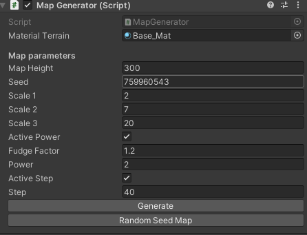

# Perlin Noise

ISART DIGITAL
Omaya Lise and  Bryan Bachelet
## Introduction :

The objective is to generate a map with Perlin noise on Unity.

## Generate a terrain
To create a map you need to select the System Manager gameobject. On the MapGenerator component, click on the button generate and random seed. The parameters influence the generation of the map.

* Map Height : Max height found on the map
* Seed : Random used for generation
* Scale : Each scale decide the octave of the noise map
* Active Power : Add a step to augment or lower the mountains heights
* Active Step :  Create terraces on the map

